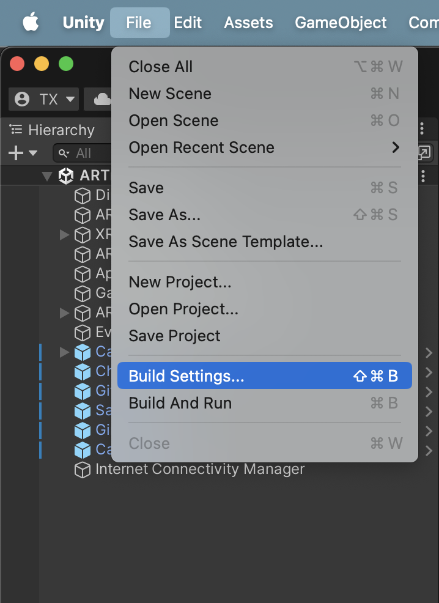
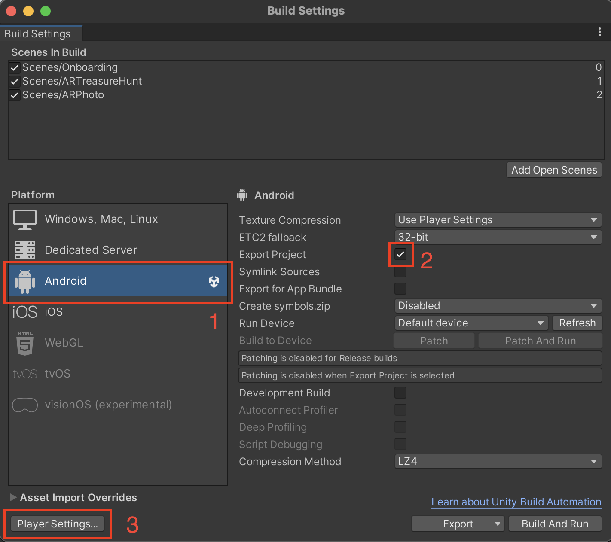
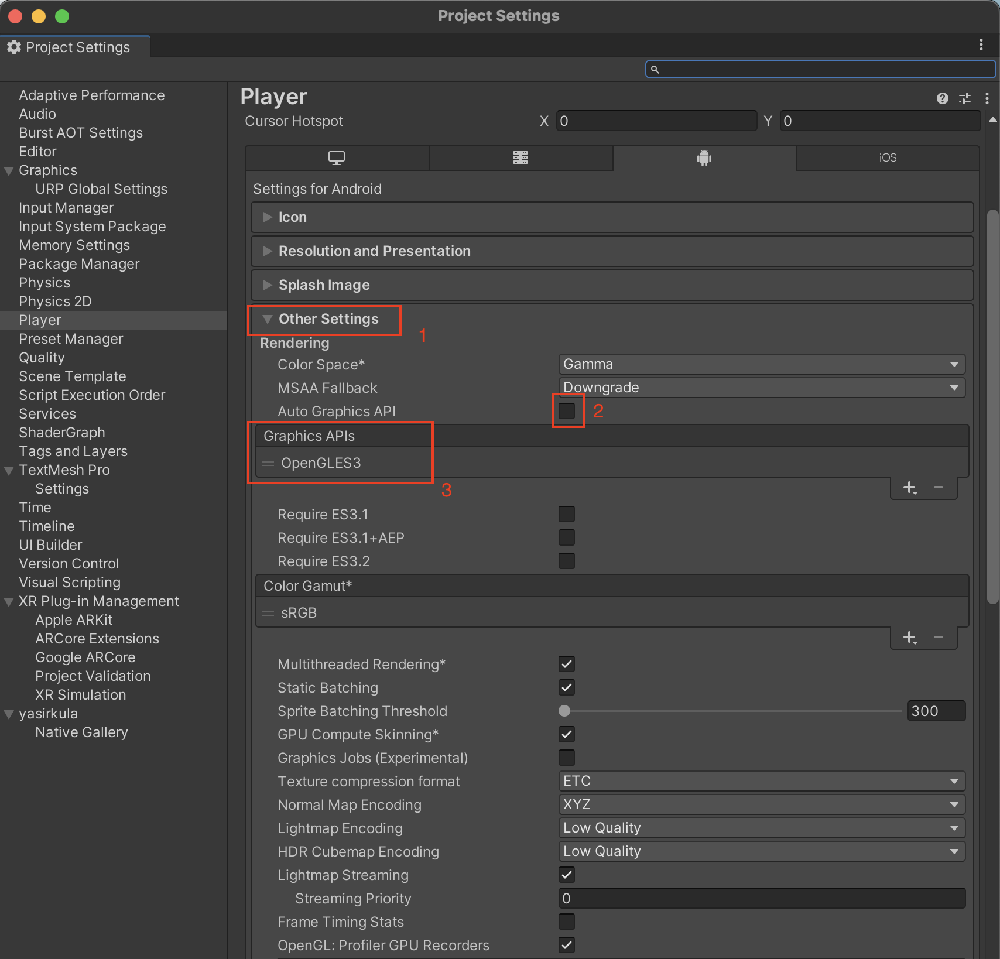
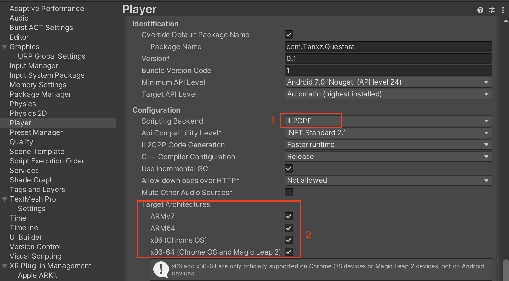
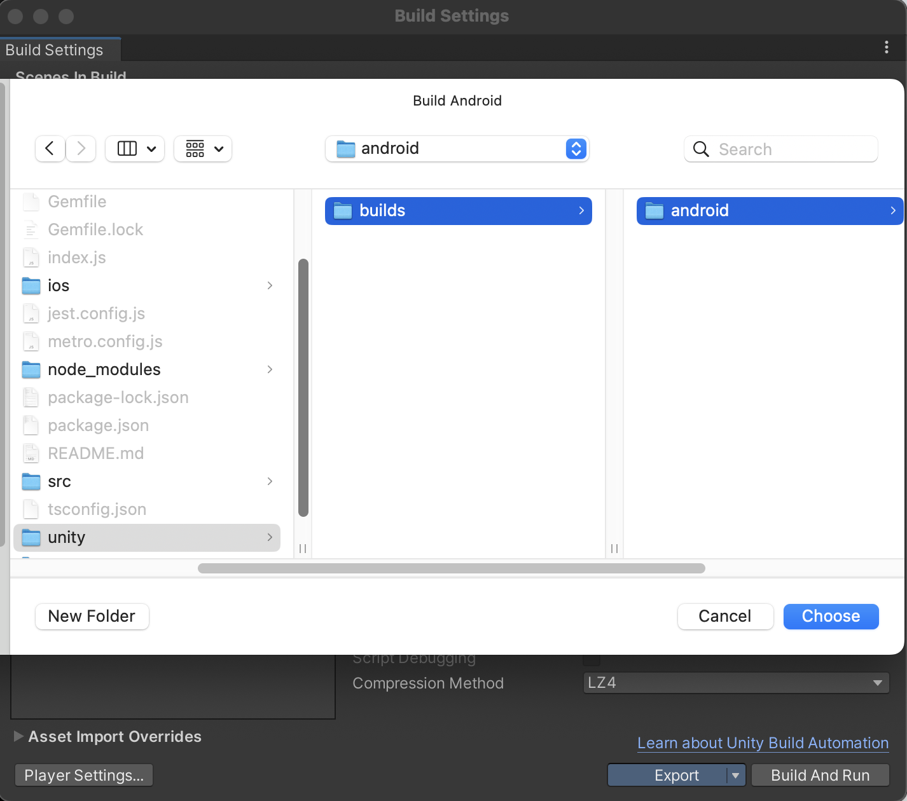

# Unity2ReactNative
This integration of unity into react native is based on the package @azesmway/react-native-unity

For your reference here are the links: https://www.npmjs.com/package/@azesmway/react-native-unity https://github.com/azesmway/react-native-unity

## Step 1: Setting up your React Native project ##
- Use the following command to create a react native project: <br>
```npx react-native init <Your_Project_Name> --template react-native-template-typescript```
- Use the following command to install the package in your react native project: <br>
```npm install @azesmway/react-native-unity```
- Install the following additional packages necessary for your project: <br>
```npm install @react-navigation/native@^6.1.17 @react-navigation/native-stack@^6.9.26 react-native-safe-area-context@^4.10.1 react-native-screens@^3.31.1 react-native-gesture-handler```
- Organize the React Native project structure by creating a “unity” folder in the root directory. Within “unity”, add a folder named “builds”, and inside “builds,” create a folder called “android”.<br>
*[project_root]/unity/builds/android*


## Step 2: Setting up your Unity project ##
NOTE: Make sure that you have a working Unity project; so that it can be exported
- Open your Unity project. Select Build Settings under the file drop down <br>
*File -> Build Settings*

- Select Android under the Platform options & check the Export Project & at last click Switch Platform as shown below. <br>

- NOTE: Make sure these options are checked in configuration menu under the Player Settings. Click on Other settings and uncheck Auto Graphics API then add OpenGL ES3 by clicking on (+) on the right.<br>

- Scrolling a little bit down you can find the Configuration section. We must enable some options there. Start by changing the Scripting Backend from Mono to IL2CPP, which should allow us to enable some more Target Architectures.<br>

- Click export to export the unity project in the directory we created earlier in the React Native project.<br>
*[project_root]/unity/builds/android*

For convenience, you can use the pre-exported Unity project available in the repository. You can find this project under the folder named "**unity**".


## Step 3: Integrating Unity into React Native ##
- After exporting the Unity project to unity/builds/android.
Add the following lines in **android/settings.gradle**:
```
include ':unityLibrary'
project(':unityLibrary').projectDir=new File('..\\unity\\builds\\android\\unityLibrary')
```
- Add into **android/build.gradle***:
```
allprojects {
  repositories {
    // this
    flatDir {
        dirs "${project(':unityLibrary').projectDir}/libs"
    }
    // ...
  }
}
```
- Add into **android/gradle.properties**:
```
unityStreamingAssets=.unity3d
```
- Add strings to **android/app/src/main/res/values/strings.xml**:
```
<string name="game_view_content_description">Game view</string>
```
- Remove **<intent-filter>...</intent-filter>** from **<project_name>/unity/builds/android/unityLibrary/src/main/AndroidManifest.xml** at unityLibrary to leave only integrated version

- Possibly due to the incomplete matching between the versions of the built-in NDK and SDK in Unity and those in the react-native project, in addition to the configurations required to be changed in the [Reat-Native-Unity](https://github.com/azesmway/react-native-unity) library, we also need to make the following changes:
  1. Added `ndkVersion '23.1.7779620'` in `[project_root]/unity/builds/android/unityLibrary/build.gradle` (line 22).
  2. Changed `${rootDir}` to `[project_root]/unity/builds/android` at line 61 in `[project_root]/unity/builds/android/unityLibrary/build.gradle`.
  3. Changed `minSdkVersion = 23` to 24 in line 4 of `[project_root]/android/build.gradle`.
  4. Changed `"26.1.10909125"` to `"23.1.7779620"` at line 7 in `[project_root]/android/build.gradle`.
  5. Added the ninth line `include ':unityLibrary:xrmanifest.androidlib'` in `[project_root]/android/settings.gradle`.
  6. Ensured the selected NDK version is `23.1.7779620` in the Android Studio SDK Tools.
   - Note: The Unity version I used here is 2022.3.16f1.

- After the setup is ready, proceed to code. What I did is modify `index.js`, and create a new `src` folder along with `App.tsx`, `Unity.tsx`, and `Main.tsx`.

- Now it's time to `npm start` and check the integration of React Native & Unity on Android. 

## Issues ##
### 1. UnityView Rendering Issue with react-navigation

When using the `UnityView` component with `react-navigation` stack, the `UnityView` loads correctly the first few times the stack screen is mounted. However, if you navigate to another screen multiple times and then return to the Unity screen, the `UnityView` component will fail to render. This issue has been noted in the `react-native-unity` library's Issues section, similar to the following reports:
- [Issue #15](https://github.com/azesmway/react-native-unity/issues/15)
- [Issue #105](https://github.com/azesmway/react-native-unity/issues/105)
- [Issue #108](https://github.com/azesmway/react-native-unity/issues/108)

### 2. Permission Request Issue

Before integrating into React Native, both location and camera permissions would pop up normally. However, after integration, only the location permission pops up, and the camera permission does not. It appears that the Unity game itself cannot properly request permissions, and instead, the React Native wrapper app needs to handle these requests. This issue has been reported similarly in the following issues:
- [Issue #50](https://github.com/azesmway/react-native-unity/issues/50)
- [Issue #89](https://github.com/azesmway/react-native-unity/issues/89)

We may need to declare the permissions required by the application in `/android/app/src/main/AndroidManifest.xml`.
Reference: [AndroidManifest.xml](https://github.com/azesmway/react-native-unity/blob/2ffb1587564c395fd5609e9443f09893cc3bdcf1/example/android/app/src/main/AndroidManifest.xml)